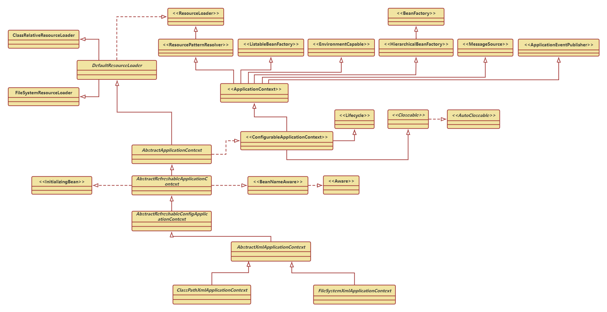

# spring-core

## 基本

配置文件:  **spring-PeppaPig.xml**

~~~ xml
<?xml version="1.0" encoding="UTF-8"?>
<beans>
    <bean id="user" class="com.peggy.dao.User"/>
</beans>
~~~

启动代码:  **Test.java**

~~~ java
public class Test {
	public static void main(String[] args) {
        ApplicationContext context=new ClassPathXmlApplicationContext("spring-PeppaPig.xml");
    }
}
~~~

注入对象: **User.java**

~~~ java
public class User {
	private String id;
	private String userName;
}
~~~

### ClassPathXmlApplicationContext

继承关系流程图如下：[**pdf 文件地址**](www)

主要的核心类和接口说明:
